# RAG Chatbot Platform

A complete Retrieval-Augmented Generation (RAG) platform built for hands‑on exploration of modern RAG systems.

This project includes:

- **Streamlit** apps
  - 📚 *Index Manager* for ingestion and monitoring
  - 💬 *Chatbot* UI with multi‑session history
- **Qdrant** as the vector database
- **PostgreSQL** (via SQLModel) for conversation history
- **Langfuse v2** for tracing and observability
- **OpenAI** embeddings + chat models
- **Docker Compose** for one‑command local setup
- A TXT‑based ingestion pipeline (from `data/`)

---

## 🧱 Project Structure

```bash
kontron-rag-chatbot/
├── docker-compose.yml
├── requirements.txt
├── .env                     # Your environment variables (not committed)
├── data/                    # TXT files to index (mounted into index manager)
│   └── ...
├── backend/
│   ├── __init__.py
│   ├── db.py                # SQLModel engine and session (PostgreSQL)
│   ├── models.py            # ORM models (Message, etc.)
│   ├── repository.py        # CRUD helpers for conversation history
│   ├── rag.py               # RAG pipeline (Qdrant + OpenAI + Langfuse)
│   └── ingest.py            # Chunking + embeddings + upsert into Qdrant
├── apps/
│   ├── __init__.py
│   ├── index_manager_app.py # Streamlit app for ingestion/index management
│   ├── chatbot_app.py       # Streamlit chatbot app
│   ├── Dockerfile.index_manager
│   └── Dockerfile.chatbot
└── ...
```

---

## 🔐 Environment Configuration

Create a `.env` file in the project root (same folder as `docker-compose.yml`).

Only these variables are required:

```env
# --- OpenAI ---
OPENAI_API_KEY=your_openai_api_key_here

# --- Models ---
EMBEDDING_MODEL=text-embedding-3-small
CHAT_MODEL=gpt-4o-mini

# --- Langfuse (v2, self‑hosted) ---
LANGFUSE_HOST=http://langfuse:3000
LANGFUSE_PUBLIC_KEY=
LANGFUSE_SECRET_KEY=

# --- Ingestion (optional override) ---
DATA_DIR=data
```
---

## 🧭 Langfuse Setup (Self‑Hosted v2)

Langfuse is used for **tracing the RAG pipeline** (retrieval, prompt, generations, etc.).

### 1️⃣ Start the stack (including Langfuse)

```bash
docker compose up --build -d
```

This brings up:

- `qdrant` (vector DB)
- `postgres` (chat history)
- `langfuse` (UI + its own DB, internal)
- `index-manager` (Streamlit)
- `chatbot` (Streamlit)

Langfuse UI will be available at:

> http://localhost:3000

---

### 2️⃣ Create Langfuse project + API keys

1. Open **http://localhost:3000**
2. Create an **admin account** (first‑time setup)
3. Create your **first project**
4. Navigate to **Settings → API Keys**
5. Generate:
   - a **Public key**
   - a **Secret key**

---

### 3️⃣ Update `.env` with Langfuse keys

Edit `.env`:

```env
LANGFUSE_HOST=http://langfuse:3000
LANGFUSE_PUBLIC_KEY=pk_xxxxx
LANGFUSE_SECRET_KEY=sk_xxxxx
```

Save the file.

---

### 4️⃣ Restart the chatbot service

The chatbot loads the Langfuse client at startup, so you must restart it after setting keys:

```bash
docker compose restart chatbot
```

Or, if you prefer a full restart:

```bash
docker compose down
docker compose up -d
```

After this, every OpenAI call inside the chatbot’s RAG pipeline will be traced to Langfuse.

---

### 5️⃣ Verify traces in Langfuse

1. Open the chatbot UI (see below), ask a question
2. Go back to **Langfuse UI → Traces**
3. You should see:
   - A trace per answered question
   - Input/output of the LLM call
   - Metadata like `user_id`, `session_id`, and optionally retrieved chunks

---

## 🐳 Running the Full Stack with Docker

From the project root:

```bash
docker compose up --build
```

This will start:

| Service         | Description                  | URL                     |
|----------------|------------------------------|-------------------------|
| `index-manager`| RAG Index Manager (Streamlit)| http://localhost:8501  |
| `chatbot`      | RAG Chatbot (Streamlit)      | http://localhost:8502  |
| `qdrant`       | Qdrant vector DB             | http://localhost:6333  |
| `postgres`     | Conversation history DB      | (no direct UI)         |
| `langfuse`     | Tracing / Analytics UI       | http://localhost:3000  |

Stop everything:

```bash
docker compose down
```

---

## 📦 Ingestion: Chunking + Embeddings + Qdrant Index

The ingestion logic lives in `backend/ingest.py`.

It:

1. Scans a folder for `.txt` files (`DATA_DIR`, default: `data/`)
2. Loads each file’s contents
3. Applies **recursive character chunking** (`RecursiveCharacterTextSplitter`)
4. Calls OpenAI embeddings (`text-embedding-3-small`)
5. Ensures the Qdrant collection exists (creating it if needed)
6. Uploads all chunk vectors + payloads (source file, chunk index, text) to Qdrant

### Add TXT files

Put your documents into:

```bash
data/your_file_1.txt
data/your_file_2.txt
...
```

These are mounted into the `index-manager` container.

### Run ingestion (inside Docker)

```bash
docker compose exec index-manager python -m backend.ingest
```

You should see:

- File discovery
- Chunk counts per file
- tqdm progress bars for embedding and upload
- Final confirmation of total chunks indexed

---

## 📚 Index Manager App (Streamlit)

The **Index Manager** UI (`apps/index_manager_app.py`) is a simple frontend for:

- Showing where data is loaded from (`DATA_DIR`)
- Triggering ingestion from the UI
- Checking that Qdrant is reachable
- Inspecting the number of stored vectors (depending on implementation)

Once the stack is running:

> http://localhost:8501

Use this app when:

- You add new TXT files
- You want to rebuild the index
- You want to verify Qdrant connectivity

---

## 💬 Chatbot App (Streamlit)

The **Chatbot UI** (`apps/chatbot_app.py`) connects:

- the user,
- the conversation history in PostgreSQL,
- the Qdrant vector store,
- the OpenAI LLM,
- and Langfuse tracing.

Key features:

- **User ID** field in the sidebar  
- **Session ID** selection/creation (like conversation tabs)  
- Automatic **RAG** on each question:
  1. Embed the latest user query
  2. Retrieve top‑k chunks from Qdrant
  3. Build a prompt with context + conversation history
  4. Call OpenAI chat model
  5. Save the full message sequence in PostgreSQL
  6. Trace the call in Langfuse (if configured)

Open it at:

> http://localhost:8502

---

## 🧠 RAG Pipeline (Backend / `backend/rag.py`)

The `answer_with_rag` function implements the core RAG workflow:

1. **Embedding**  
   `embed_text(text)` uses OpenAI’s embedding model (`EMBEDDING_MODEL`).

2. **Retrieval**  
   `semantic_search(query, top_k)` calls `qdrant.query_points(...)` with the query vector, returning the closest chunks from the `QDRANT_COLLECTION`.

3. **Prompt Construction**  
   `build_prompt(query, retrieved_chunks, history)` creates a prompt that includes:
   - conversation history
   - a concatenated context from retrieved chunks
   - the current user question

4. **Generation**  
   OpenAI chat completions (`CHAT_MODEL`) generate the final answer.

5. **Langfuse Tracing** (optional)  
   If `LANGFUSE_PUBLIC_KEY` and `LANGFUSE_SECRET_KEY` are set:
   - a `trace` is created per interaction
   - a `generation` is attached for the LLM call
   - metadata (e.g. user, session, query, retrieved chunks) can be attached
   - `generation.end()` and `trace.update()` close the trace cleanly

---

## 🗄 Conversation History (PostgreSQL + SQLModel)

`backend/db.py` configures the SQLModel engine using:

```python
PG_HOST = os.getenv("PG_HOST", "postgres")
PG_PORT = os.getenv("PG_PORT", "5432")
PG_USER = os.getenv("PG_USER", "appuser")
PG_PASSWORD = os.getenv("PG_PASSWORD", "apppass")
PG_DB = os.getenv("PG_DB", "appdb")

DATABASE_URL = f"postgresql://{PG_USER}:{PG_PASSWORD}@{PG_HOST}:{PG_PORT}/{PG_DB}"
```

`backend/models.py` defines the `Message` model with fields like:

- `id`
- `user_id`
- `session_id`
- `role` (`"user"` / `"assistant"`)
- `content`
- `created_at`

`backend/repository.py` provides helper functions:

- `save_message(user_id, session_id, role, content)`  
- `get_messages_for_session(user_id, session_id, limit=50)`

These are used by the chatbot app to save/load conversation history.

---

## 🧱 High‑Level Architecture

```mermaid
flowchart TD

%% ================
%% INGESTION PATH
%% ================

subgraph INGESTION["Ingestion Pipeline"]
    A1["📂 TXT Files<br/>data/*.txt"]
    A2["📥 Ingestion Script<br/><code>backend/ingest.py</code>"]
    A3["✂️ Chunking<br/>Recursive Text Splitter"]
    A4["🧮 Embeddings<br/>OpenAI <code>text-embedding-3-small</code>"]
    A5[("🗄️ Qdrant Vector DB<br/><code>documents</code> collection")]

    A1 --> A2 --> A3 --> A4 --> A5
end

%% ================
%% CHATBOT PIPELINE
%% ================

subgraph CHATBOT["Chatbot Pipeline (apps/chatbot_app.py)"]
    B1["💬 User"]
    B2["📝 User Question"]
    B3["🧮 Query Embedding<br/>OpenAI Embeddings"]
    B4["🔎 Retrieve Top-k Chunks"]
    B5["🧱 Build RAG Prompt<br/>Context + History + Query"]
    B6["🤖 OpenAI Chat Model<br/><code>gpt-4o-mini</code>"]
    B7["💡 Final Answer"]
end

%% ================
%% SUPPORTING SYSTEMS
%% ================

subgraph STORAGE["Storage + Observability"]
    C1[("🗃️ PostgreSQL<br/>Conversation History")]
    C2[("📊 Langfuse v2<br/>Tracing & Analytics")]
end

%% ================
%% FLOWS
%% ================

%% User → Chatbot
B1 --> B2 --> B3

%% Embedding ↔ Qdrant
B3 <-.-> |"vector search"| A5

%% Qdrant → retrieved chunks
A5 --> B4

%% Retrieval → Prompt → LLM
B4 --> B5 --> B6 --> B7

%% LLM Output saved + traced
B6 --> C1
B6 --> C2

```



---

## 🛠 Local Development Without Docker (Optional)

You *can* run the apps directly on your host, but you must provide:

- A running Qdrant instance
- A running PostgreSQL instance
- A running Langfuse (optional but recommended)
- A correctly populated `.env`

Example:

```bash
pip install -r requirements.txt

# Index manager
streamlit run apps/index_manager_app.py --server.port=8501

# Chatbot
streamlit run apps/chatbot_app.py --server.port=8502
```

But in most teaching/demo contexts, using **Docker Compose is much easier** and recommended.

---

## ✅ Summary

This project gives you a complete, end‑to‑end RAG stack ready for:

- Workshops and trainings
- Internal knowledge assistants
- Demonstrations of:
  - chunking & ingestion,
  - vector search with Qdrant,
  - LLM‑powered answering,
  - multi‑session chat history,
  - and observability via Langfuse.

